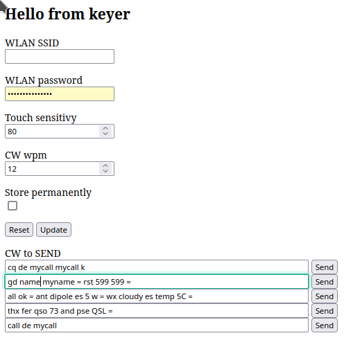

# esp32keyer

## Simple Touch CW keyer based on a ESP32 microcontroller

Basic idea: Hey, i have this awesome ESP32, which is able to read touch sensors and it has WiFi onboard. Lets create a CW keyer!
The keyer supports the lambic b mode, configuration via web GUI and text to morse code.

### Hardware
Print the STL files and attach self adhesive aluminiom foil to both sides of the paddle and connect with short cables to the microcontroller.

 
